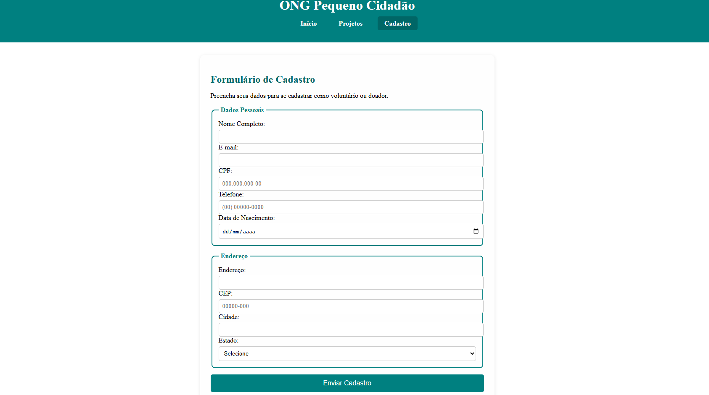

# 🌟 Pequeno Cidadão — Apoio à Comunidade


Site institucional da ONG **Pequeno Cidadão**, dedicado a fortalecer crianças e famílias por meio de **educação, cultura e lazer**.  
# 📚             Projetos
  
# 🤝            Página Inicial
 
 
# ✉️             Cadastros


---

## 💡 Sobre o Projeto

O **Pequeno Cidadão** é um projeto web moderno e responsivo que apresenta:

- **📚 Projetos**: Oficinas de leitura, reforço escolar e eventos comunitários  
- **🤝 Voluntariado**: Incentivo à participação de voluntários  
- **💰 Doações**: Opções de contribuição para apoiar os projetos  
- **✉️ Contato**: Formulário para dúvidas, sugestões e parcerias  

O site foi desenvolvido com **HTML5, CSS3 e JavaScript puro**, focando em **acessibilidade, responsividade e design moderno**.

---

## 🛠 Tecnologias


---

## 📂 Estrutura do Projeto

projeto-pequeno-cidadao/
---
│
├─ index.html # Página principal
---
├─ styles.css # Estilos do site
---
├─ /images # Imagens usadas no site
---


---

## 🚀 Como Executar

1. Clone o repositório:  
```bash
git clone https://github.com/seu-usuario/projeto-pequeno-cidadao.git
Entre na pasta do projeto:

bash
Copiar código
cd projeto-pequeno-cidadao
Abra index.html no navegador:

bash
Copiar código
start index.html  # Windows
open index.html   # Mac
xdg-open index.html # Linux
💡 Dica: Você pode publicar este projeto no GitHub Pages para ter um site online grátis!

✨ Funcionalidades
✅ Menu de navegação fixo e responsivo

✅ Seção de projetos com cards informativos

✅ Formulário de contato (necessita backend para envio real)

✅ Botões de voluntariado e doação

✅ Rodapé com ano atualizado automaticamente

🎨 Personalização
Substitua as imagens na pasta /images para adequar ao seu conteúdo

Altere textos, cores e links conforme a necessidade da ONG

Ajuste estilos no styles.css para mudar fontes, cores e layout

📢 Contribuição
Contribuições são bem-vindas!

Fork o repositório

Crie uma branch para sua feature:

bash
Copiar código
git checkout -b minha-feature
Commit suas alterações:

bash
Copiar código
git commit -m "Minha contribuição"
Push para a branch:

bash
Copiar código
git push origin minha-feature
Abra um Pull Request 🚀

📄 Licença
Este projeto está licenciado sob a MIT License.
Veja o arquivo LICENSE para mais detalhes.


Feito com ❤️ por [Victor Lima]
Push para a branch: git push origin minha-feature

Abra um Pull Request

