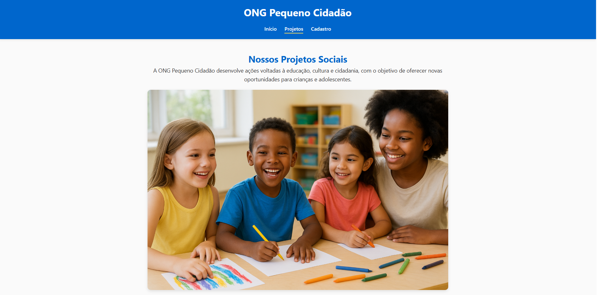

# 🌟 Pequeno Cidadão — Apoio à Comunidade

Site institucional da ONG **Pequeno Cidadão**, dedicado a fortalecer crianças e famílias por meio de **educação, cultura e lazer**.


 

---

## 💡 Sobre o Projeto

O **Pequeno Cidadão** é um projeto web voltado para a divulgação de iniciativas sociais. O site apresenta:

- **Projetos**: Oficinas de leitura, reforço escolar e eventos comunitários.  
- **Voluntariado**: Incentivo à participação de voluntários.  
- **Doações**: Formas de contribuir e apoiar as atividades da ONG.  
- **Contato**: Formulário para dúvidas, sugestões e parcerias.  

O site é **responsivo**, moderno e fácil de navegar, desenvolvido com **HTML5, CSS3 e JavaScript puro**.

---

## 🛠 Tecnologias

- **HTML5** – Estrutura semântica do site  
- **CSS3** – Layout e estilos modernos  
- **Google Fonts (Inter)** – Tipografia elegante e legível  

---

## 📂 Estrutura do Projeto

projeto-pequeno-cidadao/
│
├─ index.html # Página principal
├─ styles.css # Estilos do site
├─ /images # Imagens usadas no site
└─ README.md # Este arquivo

yaml
Copiar código

---

## 🚀 Como Executar

1. Clone o repositório:  
```bash
git clone https://github.com/seu-usuario/projeto-pequeno-cidadao.git
Entre na pasta do projeto:

bash
Copiar código
cd projeto-pequeno-cidadao
Abra index.html no navegador:

bash
Copiar código
start index.html  # Windows
open index.html   # Mac
xdg-open index.html # Linux
✨ Funcionalidades
Menu de navegação fixo e responsivo

Seção de projetos com cards informativos

Formulário de contato (necessita backend para envio real)

Botões de voluntariado e doação

Rodapé com ano atualizado automaticamente

🎨 Personalização
Substitua as imagens na pasta /images para adequar ao seu conteúdo

Altere textos e links conforme a necessidade da ONG

Ajuste cores e fontes editando styles.css

📢 Contribuição
Contribuições são bem-vindas! Para contribuir:

Fork o repositório

Crie uma branch com sua feature: git checkout -b minha-feature

Commit suas alterações: git commit -m "Minha contribuição"

Push para a branch: git push origin minha-feature

Abra um Pull Request

